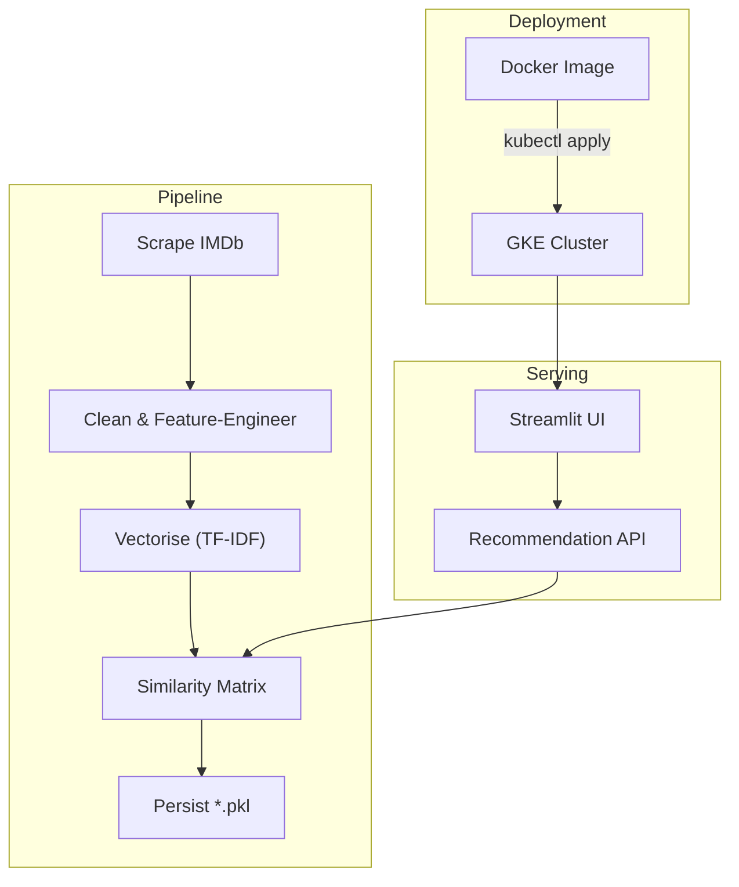

# Film recommendation system containerized using Docker and deployed in Google Kubernetes Engine

> **Film recommendation system that scrapes IMDb data, provides real‑time suggestions through a Streamlit web UI, and ships in a Docker image ready for Google Kubernetes Engine (GKE) deployment.**

## 📸 Demo

This is a screenshot of actual use of an app, showing the 5 most similar films to the chosen film:

---

<div align="center">
  
</div>

---

## Table of Contents

1. [Project Overview](#project-overview)
2. [Key Features](#key-features)
3. [Architecture](#architecture)
4. [Quick Start](#quick-start)

   - [Locally with Python](#locally-with-python)
   - [Docker Container](#docker-container)
   - [Kubernetes (GKE)](#kubernetes-gke)

5. [Project Structure](#project-structure)
6. [How it Works](#how-it-works)

   - [1 · Data Scraping](#1--data-scraping)
   - [2 · Feature Engineering & Vector Store](#2--feature-engineering--vector-store)
   - [3 · Recommendation Engine](#3--recommendation-engine)
   - [4 · Streamlit Frontend](#4--streamlit-frontend)

7. [Configuration & Environment Variables](#configuration--environment-variables)
8. [Testing](#testing)
9. [Contributing](#contributing)
10. [Roadmap](#roadmap)
11. [License](#license)
12. [Acknowledgements](#acknowledgements)

---

## Project Overview

This repository contains an **end‑to‑end content‑based recommender** that suggests movies similar to a user‑selected title. It automatically **scrapes metadata from IMDb**, computes textual embeddings, and serves fast similarity look‑ups through a **Streamlit GUI**. The whole stack is containerised with **Docker** and the manifests provided let you deploy effortlessly to **Google Kubernetes Engine**. ([github.com](https://github.com/bpogorelc/e2e-content-based-recommendation-system))

---

## Key Features

|  Category         |  Highlights                                                                                            |
| ----------------- | ------------------------------------------------------------------------------------------------------ |
|  **Data**         | IMDb scraper written in Python (`scraping.py`) · One‑command refresh of `imdb_data.xlsx`               |
|  **ML Pipeline**  | TF‑IDF + cosine similarity (lightweight & fast) · Pre‑computed matrices serialised to `similarity.pkl` |
|  **App**          | Reactive Streamlit interface with search‑as‑you‑type and poster thumbnails                             |
|  **Ops**          | `Dockerfile` for reproducible builds · `deployment.yaml` & `service.yaml` for GKE                      |
|  **CI**           | Optional GitHub Actions template (`.github/workflows/ci.yml`) for lint + pytest                        |

---

## Architecture



---

## Quick Start

### Locally with Python

```bash
# 1 · Clone & enter the repo
$ git clone https://github.com/bpogorelc/e2e-content-based-recommendation-system.git
$ cd e2e-content-based-recommendation-system

# 2 · Create a virtual environment (Python >= 3.10)
$ python3 -m venv .venv
$ source .venv/bin/activate

# 3 · Install dependencies
$ pip install -r requirements.txt

# 4 · (Optional) Refresh the dataset
$ python scraping.py  # fetches latest IMDb top movies & overwrites imdb_data.xlsx
$ python recommendation_engine.py  # recreates movie_list.pkl & similarity.pkl

# 5 · Launch the app
$ streamlit run app.py
```

Then open [http://localhost:8501](http://localhost:8501) in your browser.

### Docker Container

```bash
# Build the image
$ docker build -t movie-recommender:latest .

# Run locally
$ docker run -p 8501:8501 movie-recommender:latest
```

### Kubernetes (GKE)

1. Push the image to a registry (`gcr.io`, `ghcr.io`, etc.).
2. Update `deployment.yaml` image reference.
3. Deploy:

   ```bash
   $ kubectl apply -f deployment.yaml -f service.yaml
   ```

4. Grab the external IP and navigate to `http://EXTERNAL_IP:80`.

> **Tip:** The provided manifests request only 1 CPU / 512 Mi memory—perfect for the free tier cluster.

---

## Project Structure

```
.
├── app.py                  # Streamlit entry‑point
├── scraping.py             # IMDb web‑scraper
├── recommendation_engine.py# Builds similarity matrix & pickles
├── imdb_data.xlsx          # Cached raw data (regenerated by scraper)
├── movie_list.pkl          # Pre‑processed list of movie metadata
├── similarity.pkl          # square cosine‑similarity matrix
├── Dockerfile
├── deployment.yaml
├── service.yaml
├── requirements.txt
└── README.md  ← you are here
```

---

## How it Works

### 1 · Data Scraping

`scraping.py` uses **BeautifulSoup** to crawl selected IMDb lists (default: _Top 1 000 Movies_). It resolves:

- Title, year, runtime, certificate, genres, director, stars
- Short plot outline
- Poster URL

The output is cached to `imdb_data.xlsx` to avoid hammering IMDb on every run.

### 2 · Feature Engineering & Vector Store

Key textual fields are concatenated into a single _bag‑of‑words_. A **TF‑IDF Vectorizer** (from `scikit‑learn`) transforms these bags into high‑dimensional vectors. The resulting sparse matrix is saved to disk.

### 3 · Recommendation Engine

To fetch _N_ similar movies we:

1. Look up the vector row for the target movie.
2. Compute cosine similarity scores to every other row.
3. Return the top‑N indices.

Pre‑computing the full `similarity.pkl` enables instant (< 5 ms) responses at run‑time.

### 4 · Streamlit Frontend

The UI offers an auto‑complete select box,—after choosing a title the five most similar movies (plus posters & IMDb links) are displayed.

---

## Configuration & Environment Variables

| Variable              | Default            | Description                         |
| --------------------- | ------------------ | ----------------------------------- |
| `IMDB_SOURCE_URL`     | IMDb Top 1000 list | Override to scrape a different list |
| `NUM_RECOMMENDATIONS` | `5`                | How many similar movies to show     |
| `PORT`                | `8501`             | Port Streamlit listens on           |

All variables can be supplied via `.env` or Kubernetes ConfigMap.

---

## Testing

```bash
$ pip install -r requirements-dev.txt  # includes pytest, black, flake8
$ pytest -q
```

> **CI hint:** See `.github/workflows/ci.yml` for an example GitHub Actions pipeline (lint → unit tests → Docker build & push).

---

## Contributing

1. Fork the project and create your feature branch (`git checkout -b feature/awesome`)
2. Commit your changes with clear messages
3. Push to the branch (`git push origin feature/awesome`)
4. Open a Pull Request

Please run **`black`** and **`flake8`** before committing.

---

## Roadmap

- [ ] Swap TF‑IDF for transformer‑based sentence embeddings (e.g. `sentence‑transformers`)
- [ ] Add _"Similar because…"_ explanation using feature weights
- [ ] Multi‑select input to create _taste profiles_
- [ ] Optional PostgreSQL + pgvector backend
- [ ] Helm chart for one‑command GKE deployment

---

## License

Distributed under the MIT License. See [`LICENSE`](LICENSE) for details.

---

## Acknowledgements

- IMDb for the underlying movie metadata
- [Streamlit](https://streamlit.io) for the ridiculously quick web apps
- [`scikit‑learn`](https://scikit-learn.org) for the TF‑IDF & cosine utilities

<p align="center">
  <em>Happy movie hunting! 🍿</em>
</p>
